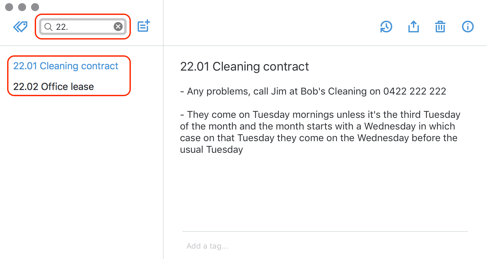

# Keeping notes

So far, we’ve mostly thought about using this system as somewhere to keep your files.

But what if you didn’t always have to write things in a Word document or create an Excel spreadsheet? What if you had a place where you could keep little notes about things?

What if it was super amazing quick so you could find anything instantly?

## Become ludicrously efficient

What I’m about to show you is probably my favourite use of the Johnny.Decimal system. **Start using this at work and watch your productivity go through the roof.**

## What, and why?

Take our 22.02 Office lease example from before. It’s great that we can store those documents in a place where we can find them again, but there’s probably stuff related to the lease that you don’t have in a document anywhere.

What was the phone number of the lawyer that you used? The reference number of the bank transaction when you paid the deposit? Maybe a list of stuff you still need to do to complete the job?

You _could_ store that stuff in a Word document, but that would be a hideous waste of time. Word takes ages to open, and it’s really hard to search through all of your Word docs simultaneously.

---

# Use Simplenote

You need some software. It’s free and available for every device you have.

It’s called <a href="https://simplenote.com">Simplenote</a>1. Download it right now, or log in and use it online.

  <ol class="footnote">
    <li>
      If you’re in a corporate environment and can’t install software, or don’t
      want to connect your stuff to ‘the cloud’, there are other excellent
      options available – see ‘Advanced note taking apps’, below.
    </li>
  </ol>

## 32.18 Oh, wow! A note

That’s it. **We keep notes here, and we start them with the Johnny.Decimal number.** Hopefully one of those cartoon lightbulbs just went off in your head. 💡

Simplenote is generally excellent because you can use the search function
to filter your notes and show those that match. That’s brilliant. But
what’s more brilliant is this.

## I only want to see things related to Contracts

Imagine this when you have hundreds of notes. **You can instantly filter to show only those notes related to a specific category by typing three characters.** It doesn’t matter what the titles of those notes are, because they’re categorised by number already.

Of course you can _combine_ this with the standard text search that Simplenote provides. This allows you to narrow down your notes instantly. Say you have notes referring to ‘client XYZ’ all through your system (as well as notes about your other clients), but you only want to see ‘any contract stuff related to client XYZ’. Just type 22. XYZ in the Simplenote search box.

---

# Advanced note taking apps

Here’s what I personally use – but don’t mess about here if you’re a beginner, Simplenote does the job. Come back when you’re _really_ comfortable with how all this works.

### At work (behind a firewall)

For Windows, <a href="http://resoph.com/ResophNotes/Welcome.html">Resophnotes</a> runs without administrator privileges and will store files locally. It _can_ sync to Simplenote, but I’ve never tried it. It’s a bit rough around the edges but it’s real fast. This is what I use every day if I’m working in a corporate environment. Free.

### At home (or if you work on a Mac)

For Mac, <a href="http://brettterpstra.com/projects/nvalt/">nvALT</a> is what I use. It synchronises to Simplenote and is quick and simple, but it’s ancient now and isn’t being updated. The developers are working on <a href="https://nvultra.com/">nvUltra</a>, which I’ll buy the instant it’s available.

For iOS, <a href="https://simplenote.com">Simplenote</a> has an app. There are tons of other options – see <a href="http://www.bear-writer.com">Bear</a>, or just search the App Store. As long as it synchronises and allows quick search of all of your notes, it’ll work.

<Navigation
  backURL="/concepts/saving-files/"
  backTitle="Saving files"
  nextURL="/concepts/tracking-your-numbers/"
  nextTitle="Tracking your numbers"
/>
